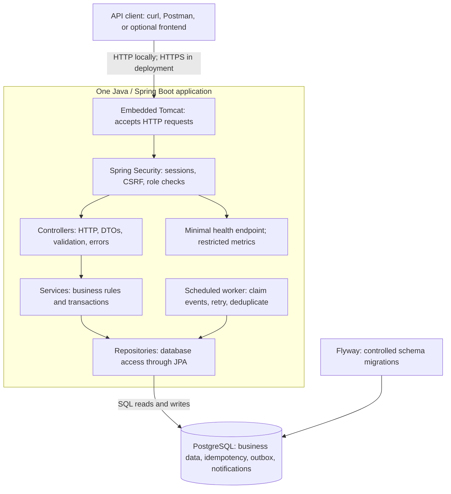
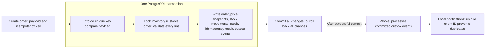
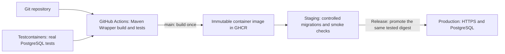

# Stockroom architecture

This is the planned architecture from PROJECT_PLAN.md. Currently implemented: the Spring Boot entry point, embedded Tomcat, Maven Wrapper, and application-context startup test. Business endpoints, security, PostgreSQL, the worker, and delivery infrastructure are planned.

## Application and request flow

Read the main path from top to bottom: Tomcat accepts a request, security checks access, a controller translates the HTTP request, a service applies the business rules, and a repository accesses PostgreSQL. The response returns through the same request path. An HTTPS entry point is required for deployment; its implementation depends on the hosting choice.

The application is organized by feature: `products`, `inventory`, `orders`, and `security`. Each feature has controller/service/repository boundaries where needed. These are packages in one application, sharing one database.

## Stock correctness and background work

The database enforces constraints as well as application validation. A failed order changes no stock; prices are snapshotted; concurrent retries return one order. Cancellation uses a transactional state transition and restores stock once. The worker may process an event again after a restart, so notification creation must be deduplicated by event ID. Low-stock alerts are suppressed until stock recovers and crosses the threshold again. External email is an optional extension.

## Build, testing, and delivery

Pull requests run checks. Main builds and publishes an image, then deploys staging. A release promotes that tested image to production. Deployments are serialized and migrations are controlled; backup, restore, and rollback procedures must be verified. PostgreSQL and the application run locally through Docker Compose when persistence is introduced. Hosting is still undecided.

## Learning checkpoint

Trace a request to create an order through the first diagram. Which component should decide whether enough stock exists, and why should all order lines be handled within one transaction?
