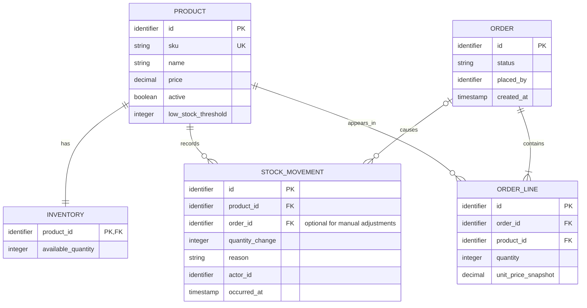

# Domain model — Chapter 2

Status: planned design, not an implemented schema. This increment documents the five core business records and their relationships. It builds on `product-model.md`. ID types, field limits, currency, and money precision remain undecided.

## Records and relationships

`PK` means primary key: the identity of a record. `FK` means foreign key: a reference to another record. `UK` marks the unique SKU. Identifier and decimal types are conceptual here; exact PostgreSQL types will be chosen before migrations.

Each product has exactly one inventory record. A product may have no movements yet, or many; it may appear in many order lines. Each order has at least one line, and each line belongs to exactly one order and one product. An order may cause multiple stock movements. A manual stock receipt has no associated order. Actors will reference accounts once the security/account model is designed; timestamps are UTC.

## Red Book example

| Product field | Value |
| --- | --- |
| SKU | BOOK-RED |
| Name | Red Book |
| Price | 2.50, currency undecided |
| Active | true |
| Low-stock threshold | 5 |

Starting from 20 available books, receiving 10 creates a +10 movement and raises stock to 30. Placing an order for four creates an order line with quantity 4 and unit-price snapshot 2.50, a -4 movement, and available stock of 26. The line total is 10.00. Changing the catalog price later does not change this order line.

The example assumes the initial 20 books were received earlier. In the proposed implementation, inventory starts at zero and initial stock is received through an audited adjustment, so movement history explains the full balance.

## Order lifecycle

```mermaid
stateDiagram-v2
    [*] --> PLACED: Create order and deduct stock
    PLACED --> FULFILLED: Complete order; no further deduction
    PLACED --> CANCELLED: Restore stock once
```

FULFILLED and CANCELLED are terminal states. A fulfilled order cannot be cancelled; returns are outside scope. A repeated cancellation must not restore stock again. Its precise HTTP response will be defined in the API contract.

If the Red Book order above is cancelled, stock returns from 26 to 30 and a +4 cancellation movement is recorded. A second cancellation leaves stock at 30 and creates no second restoration movement. The order and its lines remain in history.

## Transaction and concurrency rules

- Order creation validates every line and commits inventory updates, movements, order, price snapshots, idempotency result, and any outbox events together. Failure rolls all of them back.
- Lock inventory rows in stable product-ID order or use an equivalent safe database strategy. Stock cannot become negative, even when concurrent orders compete for the last unit.
- Cancellation commits its status transition, inventory restoration, movements, and applicable outbox events together. Serialize conflicting transitions so fulfilment/cancellation produces one valid final state.
- Enforce SKU uniqueness, nonnegative inventory, positive line quantities, foreign keys, and valid statuses in PostgreSQL as well as appropriate service validation. Creating an order with at least one line requires transactional service validation.
- Repeated order requests with the same idempotency key and payload return the original result; changed payloads conflict. Database uniqueness coordinates concurrent retries.
- Archive products instead of deleting records referenced by history.

The diagram covers core business data only. Account roles, state-transition audit history, idempotency, outbox events, and local notifications need additional records as the complete schema is developed. Proposed duplicate-line policy: combine quantities per product before stock validation and persistence; overflow and nonpositive quantities must be rejected. This proposal will be finalized with the API contract.

## Remaining acceptance criteria

Chapter 2 still needs endpoint requests/responses, permissions, failure cases, OpenAPI, and an architecture decision record. Currency, SKU normalization, monetary bounds, archive behavior, and the exact low-stock threshold comparison remain open decisions. No domain code, migrations, or endpoints were added in this increment.

Exercise: trace an order containing a Red Book and a Blue Pen through this diagram. Explain which records change if the pen has insufficient stock. The expected invariant is that the whole order fails without changing either product's stock.
